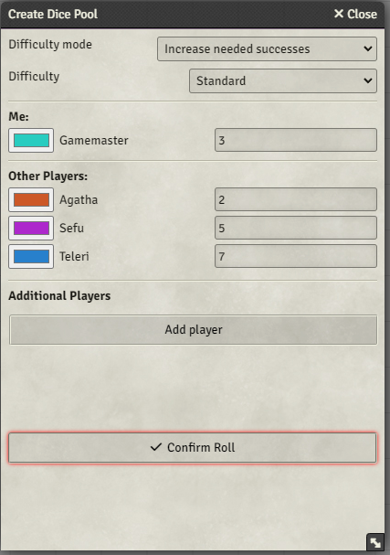
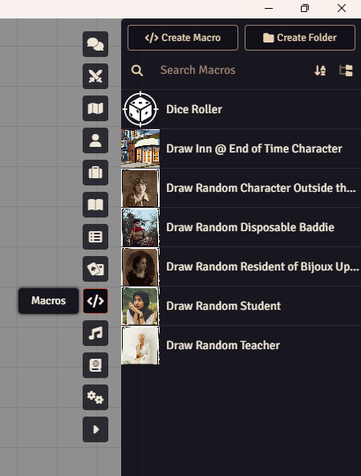
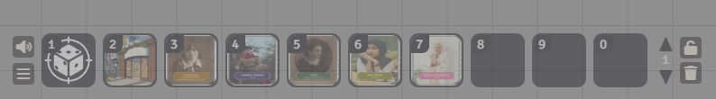
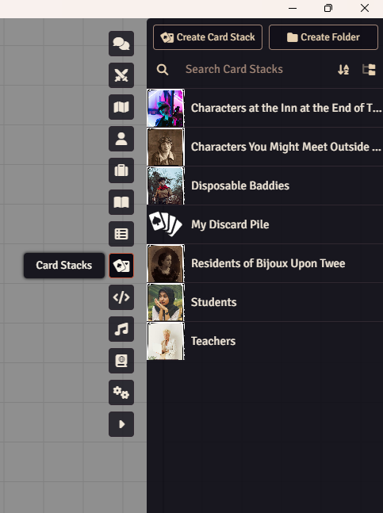
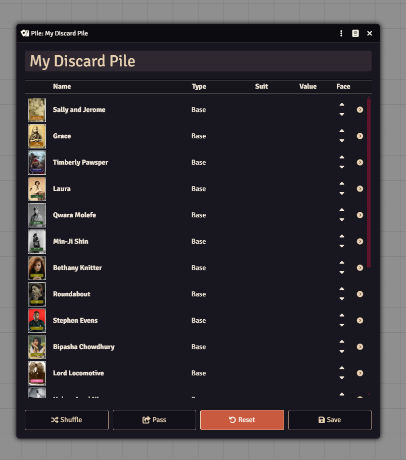

# PEatAA TTRPG Compendium

> Pre-release / Playtesting Build — This module is in active development. Things may break. Please report issues to https://github.com/pingleingskjdksjksjaid12/PEatAA-basic/issues

## Installation

In Foundry VTT Setup, go to **Add-on Modules → Install Module**, paste the following manifest URL into the box at the bottom, and click Install:

```
https://raw.githubusercontent.com/pingleingskjdksjksjaid12/PEatAA-basic/main/module.json
```

---

# Crucial Information

We don't currently have a full game system working for this game. Because of that we've had to bodge some game systems together.

### Character Sheets

We've included six pregenerated characters and six assignable characters.

These work by referencing a form-fillable PDF in the module data folder. When you import the character sheet compendium make sure to also import the `_pdf-sheets` journal article, or you'll have to manually relink the Foundry Actors to their character sheets.

This workaround is the reason the PDF Sheets module is a dependency for this module.

### Dice Roller

The Mechanics and Useful Gubbins compendium has many useful macros, chief of which is a dice roller.

To operate the dice roller, click on it, and it'll bring up a window:



It should auto-populate with your players, with the current player at the top. Simply add the number of dice each player is contributing to the dice pool and click roll. The result will appear in the chat. Click on the calculations part of the message to see a breakdown of whose dice did what.

I've included a legacy dice roller that doesn't auto-populate in case you run into bugs.

### The Macro Bar

I recommend dragging the dice roller macro down to the hotbar at the bottom of Foundry so you can launch the dice roller just by clicking on it.

In case you're unfamiliar, you can find the macro bar by clicking the `</>` icon on the right side of the screen. It opens this:



You can launch and edit macros from here but it's a bit of a faff. I recommend dragging macros from the sidebar to the hotbar at the bottom of the screen.

To do this, just click and drag the Dice Roller macro to a slot on the hotbar:


I recommend doing this with the card deck macros as well. My hotbar looks like this:



---

## Fun Extras

### Random Characters

I've included several card decks for random NPCs the GM can draw during a game if, say, the players bump into a random teacher, the GM can draw a card from the 'teachers' deck.

### Cards in FoundryVTT

Anyone who's tried to use cards in FoundryVTT before will know they don't work brilliantly (or, arguably, at all) out of the box.

For this reason, I recommend using the macros in the macro folder to draw cards rather than trying to interact with the card decks directly. If you execute a macro (either by adding it to the hotbar at the bottom of the screen — which I recommend — or by loading the macro from the macro menu in the sidebar), it'll automatically draw a random card from the appropriate card deck. Give it a go!

This is the Macro bar:


Whilst this is the card stack bar:



### Resetting the Decks

Drawing a card from a card stack moves it to a discard pile, meaning that card can't be drawn again until the discard pile is reset.

To reset the discard pile click on 'My Discard Pile' in the card stacks section and click reset:



If the discard pile is empty it means no cards have been played so far.

These card decks are why the Orcnog Card Viewer and Socketlib modules are dependencies for this module.
